# Домашнее задание к занятию "`Очереди RabbitMQ`" - `Котуков Евгений`

### Задание 1. Установка RabbitMQ

Используя Vagrant или VirtualBox, создайте виртуальную машину и установите RabbitMQ.
Добавьте management plug-in и зайдите в веб-интерфейс.

*Итогом выполнения домашнего задания будет приложенный скриншот веб-интерфейса RabbitMQ.*

### Решение:

Т.к. ресурсов на ноутбуке для подъема нескольких ВМ у меня ограниченное количество, \
Буду поднимать каждую реплику RMQ в отдельном контейнере на одной виртуалке

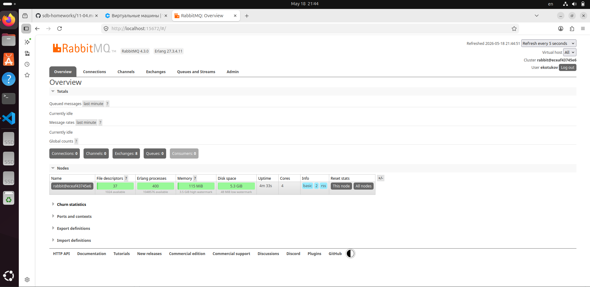

---

### Задание 2. Отправка и получение сообщений

Используя приложенные скрипты, проведите тестовую отправку и получение сообщения.
Для отправки сообщений необходимо запустить скрипт producer.py.

Для работы скриптов вам необходимо установить Python версии 3 и библиотеку Pika.
Также в скриптах нужно указать IP-адрес машины, на которой запущен RabbitMQ, заменив localhost на нужный IP.

```shell script
$ pip install pika
```

Зайдите в веб-интерфейс, найдите очередь под названием hello и сделайте скриншот.
После чего запустите второй скрипт consumer.py и сделайте скриншот результата выполнения скрипта

*В качестве решения домашнего задания приложите оба скриншота, сделанных на этапе выполнения.*

Для закрепления материала можете попробовать модифицировать скрипты, чтобы поменять название очереди и отправляемое сообщение.

### Решение:

Запустил скрипт producer.py на несколько секунд, \
но т.к. версия RMQ у меня 4.3.0, то пришлось доработать скрипт \
и явно прописать в объявлении очереди durable=True:

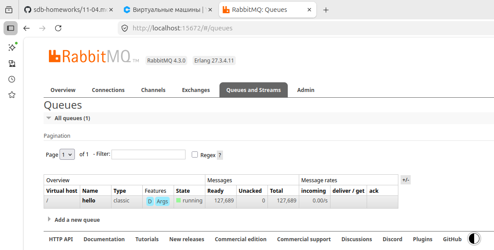

Далее запустил consumer.py, предварительно закомментировав sleep:

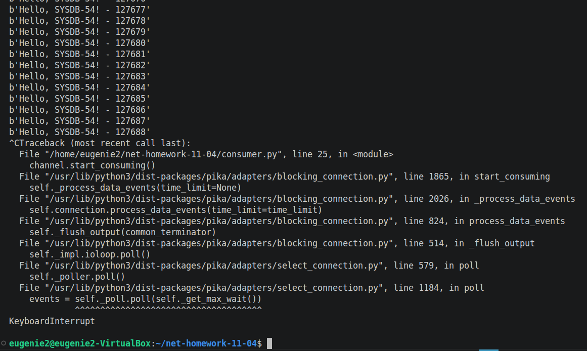

В UI видно, что сообщений в очереди не осталось:

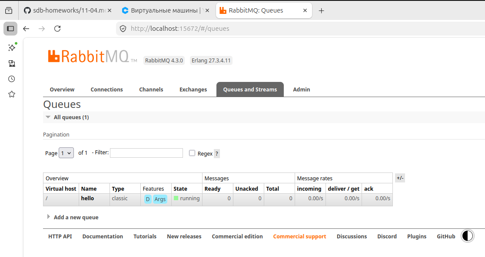

---

### Задание 3. Подготовка HA кластера

Используя Vagrant или VirtualBox, создайте вторую виртуальную машину и установите RabbitMQ.
Добавьте в файл hosts название и IP-адрес каждой машины, чтобы машины могли видеть друг друга по имени.

Пример содержимого hosts файла:
```shell script
$ cat /etc/hosts
192.168.0.10 rmq01
192.168.0.11 rmq02
```
После этого ваши машины могут пинговаться по имени.

Затем объедините две машины в кластер и создайте политику ha-all на все очереди.

*В качестве решения домашнего задания приложите скриншоты из веб-интерфейса с информацией о доступных нодах в кластере и включённой политикой.*

Также приложите вывод команды с двух нод:

```shell script
$ rabbitmqctl cluster_status
```

Для закрепления материала снова запустите скрипт producer.py и приложите скриншот выполнения команды на каждой из нод:

```shell script
$ rabbitmqadmin get queue='hello'
```

После чего попробуйте отключить одну из нод, желательно ту, к которой подключались из скрипта, затем поправьте параметры подключения в скрипте consumer.py на вторую ноду и запустите его.

*Приложите скриншот результата работы второго скрипта.*


### Решение:

Повторюсь, ресурсы для поднятия нескольких VM ограничены, поэтому \
в одной мощной VM поднял несколько инстансов RMQ через docker-compose

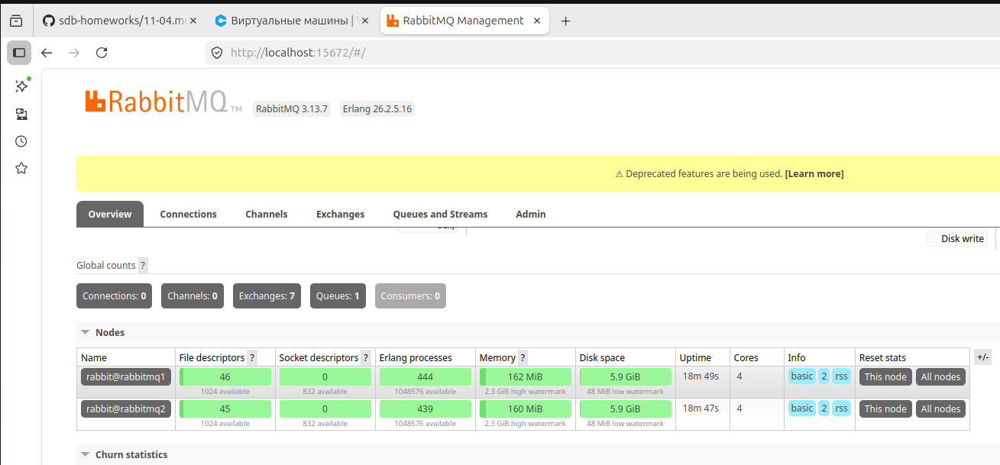

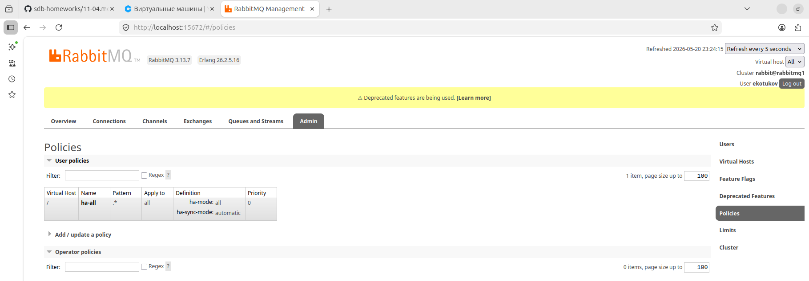

Далее вывод cluster_status с первого инстанса:
```
root@rabbitmq1:/# rabbitmqctl cluster_status
Cluster status of node rabbit@rabbitmq1 ...
Basics

Cluster name: rabbit@rabbitmq1
Total CPU cores available cluster-wide: 8

Disk Nodes

rabbit@rabbitmq1
rabbit@rabbitmq2

Running Nodes

rabbit@rabbitmq1
rabbit@rabbitmq2

Versions

rabbit@rabbitmq1: RabbitMQ 3.13.7 on Erlang 26.2.5.16
rabbit@rabbitmq2: RabbitMQ 3.13.7 on Erlang 26.2.5.16

CPU Cores

Node: rabbit@rabbitmq1, available CPU cores: 4
Node: rabbit@rabbitmq2, available CPU cores: 4

Maintenance status

Node: rabbit@rabbitmq1, status: not under maintenance
Node: rabbit@rabbitmq2, status: not under maintenance

Alarms

(none)

Network Partitions

(none)

Listeners

Node: rabbit@rabbitmq1, interface: [::], port: 15672, protocol: http, purpose: HTTP API
Node: rabbit@rabbitmq1, interface: [::], port: 15692, protocol: http/prometheus, purpose: Prometheus exporter API over HTTP
Node: rabbit@rabbitmq1, interface: [::], port: 25672, protocol: clustering, purpose: inter-node and CLI tool communication
Node: rabbit@rabbitmq1, interface: [::], port: 5672, protocol: amqp, purpose: AMQP 0-9-1 and AMQP 1.0
Node: rabbit@rabbitmq2, interface: [::], port: 15672, protocol: http, purpose: HTTP API
Node: rabbit@rabbitmq2, interface: [::], port: 15692, protocol: http/prometheus, purpose: Prometheus exporter API over HTTP
Node: rabbit@rabbitmq2, interface: [::], port: 25672, protocol: clustering, purpose: inter-node and CLI tool communication
Node: rabbit@rabbitmq2, interface: [::], port: 5672, protocol: amqp, purpose: AMQP 0-9-1 and AMQP 1.0

Feature flags

Flag: classic_mirrored_queue_version, state: enabled
Flag: classic_queue_type_delivery_support, state: enabled
Flag: detailed_queues_endpoint, state: enabled
Flag: direct_exchange_routing_v2, state: enabled
Flag: drop_unroutable_metric, state: enabled
Flag: empty_basic_get_metric, state: enabled
Flag: feature_flags_v2, state: enabled
Flag: implicit_default_bindings, state: enabled
Flag: khepri_db, state: disabled
Flag: listener_records_in_ets, state: enabled
Flag: maintenance_mode_status, state: enabled
Flag: message_containers, state: enabled
Flag: message_containers_deaths_v2, state: enabled
Flag: quorum_queue, state: enabled
Flag: quorum_queue_non_voters, state: enabled
Flag: restart_streams, state: enabled
Flag: stream_filtering, state: enabled
Flag: stream_queue, state: enabled
Flag: stream_sac_coordinator_unblock_group, state: enabled
Flag: stream_single_active_consumer, state: enabled
Flag: stream_update_config_command, state: enabled
Flag: tracking_records_in_ets, state: enabled
Flag: user_limits, state: enabled
Flag: virtual_host_metadata, state: enabled
```

И со второго:
```
root@rabbitmq2:/# rabbitmqctl cluster_status
Cluster status of node rabbit@rabbitmq2 ...
Basics

Cluster name: rabbit@rabbitmq2
Total CPU cores available cluster-wide: 8

Disk Nodes

rabbit@rabbitmq1
rabbit@rabbitmq2

Running Nodes

rabbit@rabbitmq1
rabbit@rabbitmq2

Versions

rabbit@rabbitmq2: RabbitMQ 3.13.7 on Erlang 26.2.5.16
rabbit@rabbitmq1: RabbitMQ 3.13.7 on Erlang 26.2.5.16

CPU Cores

Node: rabbit@rabbitmq2, available CPU cores: 4
Node: rabbit@rabbitmq1, available CPU cores: 4

Maintenance status

Node: rabbit@rabbitmq2, status: not under maintenance
Node: rabbit@rabbitmq1, status: not under maintenance

Alarms

(none)

Network Partitions

(none)

Listeners

Node: rabbit@rabbitmq2, interface: [::], port: 15672, protocol: http, purpose: HTTP API
Node: rabbit@rabbitmq2, interface: [::], port: 15692, protocol: http/prometheus, purpose: Prometheus exporter API over HTTP
Node: rabbit@rabbitmq2, interface: [::], port: 25672, protocol: clustering, purpose: inter-node and CLI tool communication
Node: rabbit@rabbitmq2, interface: [::], port: 5672, protocol: amqp, purpose: AMQP 0-9-1 and AMQP 1.0
Node: rabbit@rabbitmq1, interface: [::], port: 15672, protocol: http, purpose: HTTP API
Node: rabbit@rabbitmq1, interface: [::], port: 15692, protocol: http/prometheus, purpose: Prometheus exporter API over HTTP
Node: rabbit@rabbitmq1, interface: [::], port: 25672, protocol: clustering, purpose: inter-node and CLI tool communication
Node: rabbit@rabbitmq1, interface: [::], port: 5672, protocol: amqp, purpose: AMQP 0-9-1 and AMQP 1.0

Feature flags

Flag: classic_mirrored_queue_version, state: enabled
Flag: classic_queue_type_delivery_support, state: enabled
Flag: detailed_queues_endpoint, state: enabled
Flag: direct_exchange_routing_v2, state: enabled
Flag: drop_unroutable_metric, state: enabled
Flag: empty_basic_get_metric, state: enabled
Flag: feature_flags_v2, state: enabled
Flag: implicit_default_bindings, state: enabled
Flag: khepri_db, state: disabled
Flag: listener_records_in_ets, state: enabled
Flag: maintenance_mode_status, state: enabled
Flag: message_containers, state: enabled
Flag: message_containers_deaths_v2, state: enabled
Flag: quorum_queue, state: enabled
Flag: quorum_queue_non_voters, state: enabled
Flag: restart_streams, state: enabled
Flag: stream_filtering, state: enabled
Flag: stream_queue, state: enabled
Flag: stream_sac_coordinator_unblock_group, state: enabled
Flag: stream_single_active_consumer, state: enabled
Flag: stream_update_config_command, state: enabled
Flag: tracking_records_in_ets, state: enabled
Flag: user_limits, state: enabled
Flag: virtual_host_metadata, state: enabled
```

Далее в обоих инстансах выполняю команду:

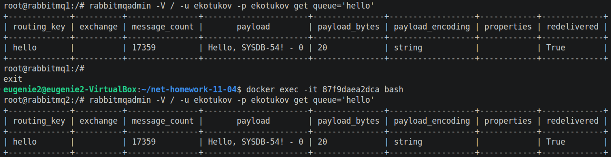

Затем останавливаю мастер-инстанс и меняю в конфиге для скрипта URI на порт для второго инстанса:

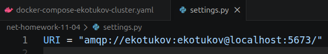

И скрипт прекрасно работает:

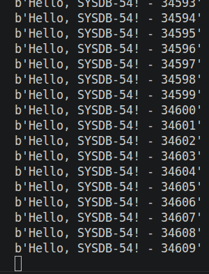

## Дополнительные задания (со звёздочкой*)
Эти задания дополнительные, то есть не обязательные к выполнению, и никак не повлияют на получение вами зачёта по этому домашнему заданию. Вы можете их выполнить, если хотите глубже шире разобраться в материале.

### * Задание 4. Ansible playbook

Напишите плейбук, который будет производить установку RabbitMQ на любое количество нод и объединять их в кластер.
При этом будет автоматически создавать политику ha-all.

*Готовый плейбук разместите в своём репозитории.*

### Решение:

Для выполнения этого задания я уже поднял две виртуалки в yandex.cloud:

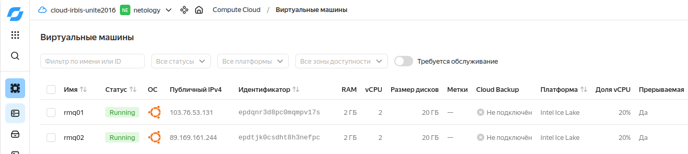

Проинициализирован ansible.cfg файл, созданы плейбук и inventory.ini \
Все файлы есть в этом репозитории \

Далее добавляю их айпишники в inventory.ini и пингую:

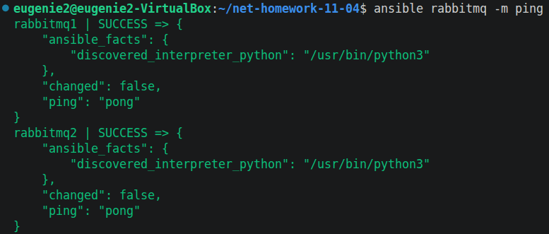

Плейбук проходит успешно:

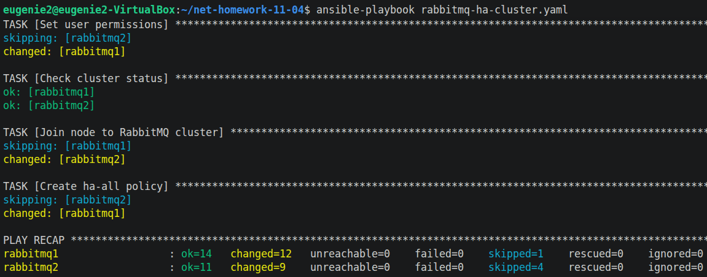

Ну и проверяет статус RMQ кластера:

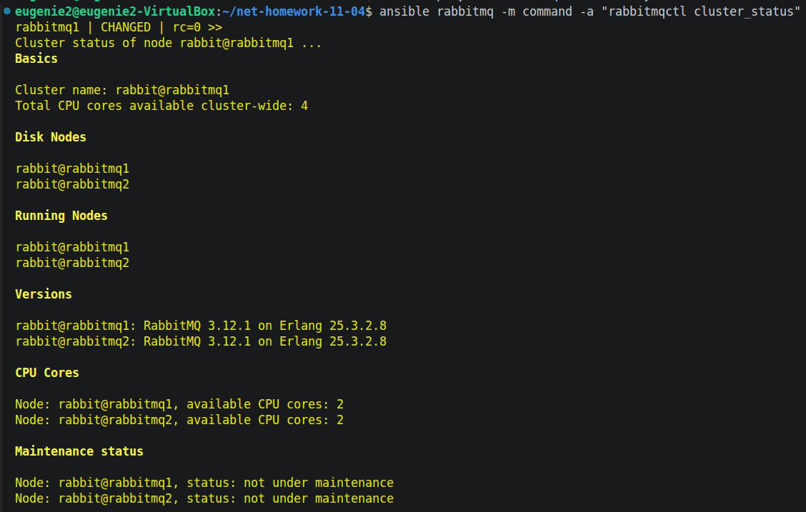